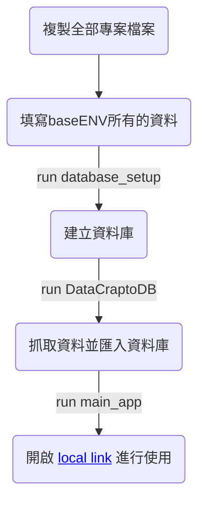

## **專案目的**
   該項目主要提供目前上市上櫃的公司，透過提供股票基本面資訊與美國專利技術分析，給予投資者進行投資的參考資料，並整合生成式AI，綜合股票與專利資訊，分析公司主要技術與基本面分析。
## **專案說明**
   - ### **公司基本資料**
      - 包含公司中英文名稱、官方網站、Email、創辦人、公司位置等
   - ### **股票資料**
      - 五年內的股價分布、營收表、股利股息表與股價的PER等
   - ### **專利資料**
      - 專利申請量、最新申請的1000篇專利清單、專利技術分類(CPC)申請量
## **專案資料來源**
   - ### 股票資料:Finmind
   - ### 專利資料:patentsView (USPTO)
## **專案檔案說明**
   - ### 專案檔案
      - ### baseENV
         - [finmind](https://finmindtrade.com/) (請先行申請好帳號，並輸入帳號密碼)
         - [patentkey](https://search.patentsview.org/docs/docs/Search%20API/SearchAPIReference/#authentication) (請先行進入USPTO patentsview 申請 api key)
         - [googleapikey](https://ai.google.dev/gemini-api/docs?hl=zh-tw) (可透過註冊google帳號申請，並在)
      - ### company_baseinfo
         - 公司基本資料資訊，主要透過下載Goodinfo資料
      - ### DataModelinfo
         - SQL中各Table的DataModel
      - ### database_setup
         - 檢測並建立SQLite資料庫，並使用DataModelinfo建立table
      - ### DataCrap
         - 串接patentsview與finmind的API
      - ### DataCraptoDB
         - 透過DataCrap抓取特定公司資料與既定年份與筆數資料，並匯入SQLite
      - ### main_app
         - 透過讀取資料，並透過資料轉換，並用Gradio在本地端創建簡易的操作前台
## **專案使用方式**

## **參考資料來源**
   - ### patentsview 美國專利局公開API 
   - ### Finmind 台股相關資料平台
